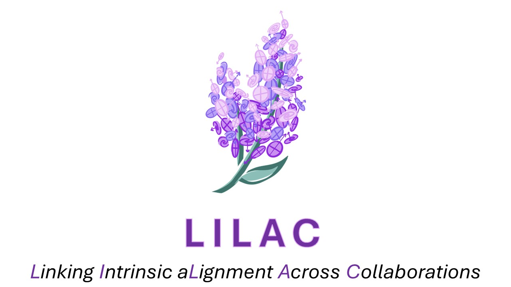

---
# You don't need to edit this file, it's empty on purpose.
# Edit theme's home layout instead if you wanna make some changes
# See: https://jekyllrb.com/docs/themes/#overriding-theme-defaults
layout: default
title: Home
order: 1
---

  

We are excited to announce the latest installment of echoIA, **LILAC: Linking Intrinsic Alignments Across Collaborations** at the Center for Astrophysics \| Harvard & Smithsonian (CfA). The core meeting will take place from Monday, May 6th to Thursday, May 9th, 2024. On Friday, May 10, we will have a work/hack day to make progress on implementing models, simulation tools, and data sets. Activites on Friday will leverage discussion from earlier in the week and are ideal for sharing insights and experience relevant for multiple collaborations.

- [About](#about)
- [Organizing Committee](#organizing-committee)
- [Code of Conduct](#code-of-conduct)

# About

Characterizing IA is necessary for upcoming cosmological surveys to meet science requirements, and IA itself is best constrained through synergies across surveys, particularly between imaging and spectroscopic data. LILAC will convene members of cosmological surveys and theory/simulation groups working on the Intrinsic Alignment (IA) of galaxies. The workshop will include short talks by ECS, technical sessions, and overview talks. These "overview" talks are intended to be both a general introduction to aspects of IA and to stimulate discussion around recent advancements. Contact an organizer if you have a topic request or would like to give one of these overview talks. Most of the meeting time will be reserved for hands-on work and discussions, prioritizing cross-collaboration project incubation. Virtual options will be available for all talks and select work sessions. 

This workshop is supported by [echo-IA](https://github.com/echo-IA), a community effort to bring together measurement and modeling experts to coordinate the analysis of future measurements within a common framework.

**Registration is closed, but participants can update their responses via [the registration form](https://docs.google.com/forms/d/e/1FAIpQLSdgZdo5XGxEM3eLtiTYsqz63FvRK2678SgC50ngcrzq3n4yqA/viewform?usp=sf_link).**

This workshop is intended to be a collaborative and productive event. We invite participants to propose topics for focused discussion and work sessions (sprints), as well as areas for ongoing collaboration within echoIA in the registration form or by clicking this button:

<a href="https://github.com/echo-IA/LILAC/issues/new/choose" class="btn btn-info">Propose a discussion, hack, or project </a>

Proposed sessions can be found [here](https://github.com/echo-IA/LILAC/issues), please comment on the proposals to indicate your interest.

# Organizing Committee

- [Jonathan Blazek](https://cos.northeastern.edu/people/jonathan-blazek/), Northeastern University
- [Benjamin Joachimi](http://www.star.ucl.ac.uk/~joachimi/), University College London
- [Claire Lamman](https://astronomy.fas.harvard.edu/people/claire-lamman), Harvard University
- [Daniel Eisenstein](https://astronomy.fas.harvard.edu/people/daniel-eisenstein), Harvard University
- [Eske Pedersen](https://projects.iq.harvard.edu/stubbs/people/eske-pederson), Harvard University
- [Niko Sarcevic](https://blogs.ncl.ac.uk/cosmology/group/), Newcastle University

# Code of Conduct

We are committed to making the meeting productive and enjoyable for everyone, regardless of gender, sexual orientation, disability, physical appearance, body size, race, nationality or religion. We will not tolerate harassment of participants in any form. Please follow these guidelines:

Behave professionally. Harassment and sexist, racist, or exclusionary comments or jokes are not appropriate. Harassment includes sustained disruption of talks or other events, inappropriate physical contact, sexual attention or innuendo, deliberate intimidation, stalking, and photography or recording of an individual without consent. It also includes offensive comments related to gender, sexual orientation, disability, physical appearance, body size, race or religion. All communication should be appropriate for a professional audience including people of many different backgrounds. Sexual language and imagery are not appropriate. Be kind to others. Do not insult or put down other attendees. Participants asked to stop any inappropriate behavior are expected to comply immediately. Attendees violating these rules may be asked to leave the event at the sole discretion of the organizers without a refund of any charge.

Any participant who wishes to report a violation of this policy is asked to speak, in confidence, to any of the meeting organizers.

All particpants are expected to additionally abide by the [CfA Meetings & Events Conduct Policy](https://www.cfa.harvard.edu/sites/default/files/2023-06/CfA-Meeting-Conduct-Policy.pdf).

You can anonymously contact the organizers with any concern during the workshop by filling out [this form](https://forms.gle/YxPJckprX55dazDj8).