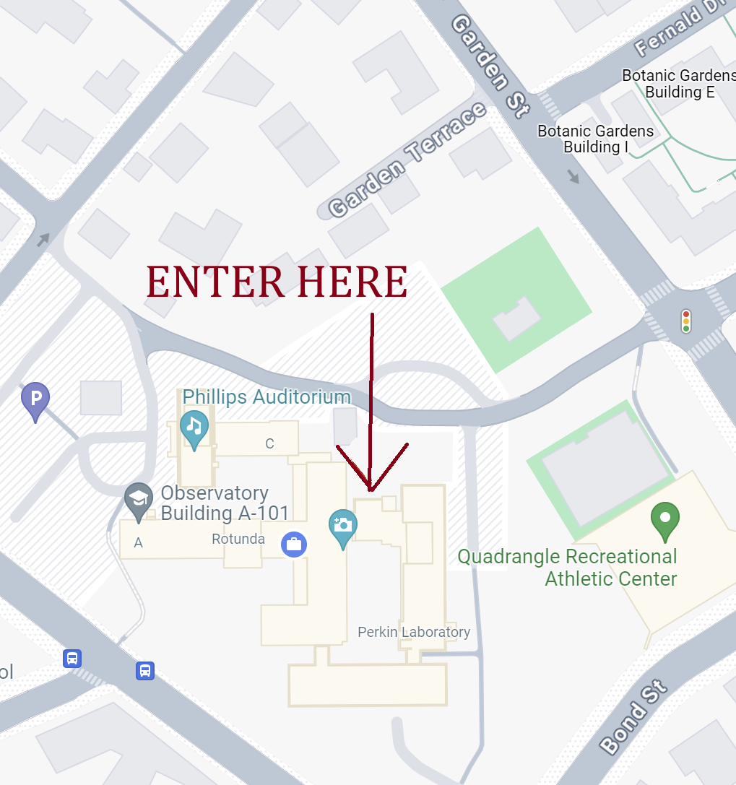

Due to generous support from the Harvard CfA and Northeastern, there is no registration fee and we will offer breakfast, lunch, and one dinner during the entire week (Monday - Friday). 

- [Connection](#connection)
- [Location](#location)
- [Accomodation](#accomodation)
- [Travel](#travel)
- [Workshop Materials](#workshop-materials)
- [Accessibility](#accessibility)

# Connection
Most communication during the workshop will happen through this slack space, which you can join via [this link](https://join.slack.com/t/lilac-a5l2263/shared_invite/zt-2hev6g1v8-uzerEd2eLuaKTNkfuvzFUA).

The workshop will be held in person and online. Zoom connection info will be made available to participants using the echoIA email list (in Google groups) and on the [schedule](https://docs.google.com/spreadsheets/d/12cglkv1jQLbwjyGQMDEkFLyL5WSw4syAcb5dAUnvLD0/edit?usp=sharing).

If you would like to be added to the echo-IA github organization, which will host echo-IA-related repositories, please enter your github username [here](https://forms.gle/i44GjtfSNJ7YUWjK6).

While all scheduled talks will be streamed, not all work sessions will have a virtual option and some may be only virtual. As the workshop is intented to be highly interactive and self-organized, the in-person/online availability will depend on the organizers of individual sessions and the level of interest.

Recordings of sessions and slides / notes will be added to the [schedule](https://docs.google.com/spreadsheets/d/12cglkv1jQLbwjyGQMDEkFLyL5WSw4syAcb5dAUnvLD0/edit?usp=sharing).

# Location 

The CfA is located at [60 Garden St, Cambridge MA](https://www.google.com/maps/place/Center+For+Astrophysics/@42.3814647,-71.1307413,17z/data=!3m1!4b1!4m6!3m5!1s0x89e3776cf27d427f:0x67a664a0e701c740!8m2!3d42.3814608!4d-71.1281664!16s%2Fg%2F11ys_jfnz?entry=ttu). 

The main workshop sessions will take place in Pratt, a conference room directly below the main lobby of the CfA (yes, the coffee machine in the lobby is free!). There will be signs inside directing you to the conference registration. The building doors are locked to those without a Harvard ID. The main entrance ([Google Map pin](https://www.google.com/maps/place/42%C2%B022'53.8%22N+71%C2%B007'40.4%22W/@42.3816063,-71.1279001,17.01z/data=!4m4!3m3!8m2!3d42.3816014!4d-71.1278958?entry=ttu)) will be proped open before the first session, and you can contact a local host over Slack to be let in at other times. 

Alternative work spaces: In addition to Pratt, we currently have the nextdoor Fishbowl room reserved for 08:00-15:00 Monday - Wednesday, 09:00-10:30 / 12:00-14:00 Thursday, and 08:00-10:00 / 11:00-16:00 Friday. Smaller groups can assemble upstairs in the CfA library, lobby, or courtyard. We additionally encourage virtual participants to liberally connect over slack and virtual breakout rooms.

  

# Travel

The nearest airport is [Boston-Logan](https://www.google.com/maps/place/Boston+Logan+International+Airport/@42.3655791,-71.0123394,17z/data=!3m1!4b1!4m6!3m5!1s0x89e37014d5da4937:0xc9394c31f2d5144!8m2!3d42.3655752!4d-71.0097645!16zL20vMDFmMDd4?entry=ttu). 

In addition to Uber / Lyft, there are decent public transport options around Cambridge. The easiest option to pay is by getting a [CharlieTicket](https://www.mbta.com/fares/subway-fares) at a subway station. You can also pay in cash for buses.

Cambridge also has a popular bike rental system, [Blue Bikes](https://bluebikes.com/).

# Accomodation

Here are reccomended hotels in the area. You may be able to find a better deal through [Airbnb](https://www.airbnb.com/s/Smithsonian-Astrophysical-Observatory--Garden-Street--Cambridge--MA--USA/homes?tab_id=home_tab&refinement_paths%5B%5D=%2Fhomes&flexible_trip_lengths%5B%5D=one_week&monthly_start_date=2024-03-01&monthly_length=3&monthly_end_date=2024-06-01&price_filter_input_type=0&channel=EXPLORE&query=Smithsonian%20Astrophysical%20Observatory%2C%20Cambridge%2C%20MA&place_id=ChIJ5ynhxqh344kRPZlRc_uRheQ&date_picker_type=calendar&checkin=2024-05-05&checkout=2024-05-11&source=structured_search_input_header&search_type=autocomplete_click). For more affordable options with a commutte, look along the [red line or commuter rail](https://www.google.com/maps/@42.3866319,-71.1315589,14.63z/data=!5m2!1e2!1e4?entry=ttu), which take you to [Porter Square](https://maps.app.goo.gl/2LzAWgKmQS2TqF2cA), a 15 minute walk from the CfA. Additionally, there are bus lines to the CfA from the cheaper areas of Belmont and Watertown.

[Sheraton Commander](https://www.marriott.com/en-us/hotels/boscs-sheraton-commander-hotel/overview/?scid=f2ae0541-1279-4f24-b197-a979c79310b0), 16 Garden St, Cambridge, MA 02138

[Porter Square Hotel](https://www.theportersquarehotel.com/), 1924 Massachusetts Ave, Cambridge, MA 02140

[Hotel 1868](https://www.hotel1868.com/), 1868 Massachusetts Ave, Cambridge, MA 02140

[Freepoint Hotel Cambridge, a Tapestry Collection](https://www.freepointhotel.com/?utm_source=google&utm_medium=organic&utm_campaign=gbp_listing), 220 Alewife Brook Pkwy, Cambridge, MA 02138

# Workshop Materials
TBA

Links to the slidedeck for project pitches and introductions will be sent to participants.

# Accessibility 
There are a small number of travel grants available to support accommodations for early-career scientists. Offers have been made to those who filled out the initial interest form; contact the organizers if you are seeking alternative support. 

The CfA building has limited options for persons unable to use stairs. If this is a concern for you, please do not hesitate to contact [Claire Lamman](mailto:claire.lamman@cfa.harvard.edu).
