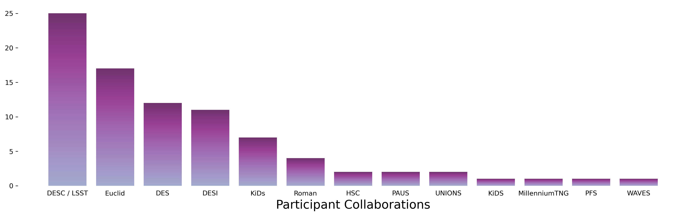

  

 
 

<table border="0" class="dataframe participants-table">
  <thead>
    <tr style="text-align: right;">
      <th>No.</th>
      <th>Participant</th>
      <th>Affiliation</th>
      <th>Attendance</th>
    </tr>
  </thead>
  <tbody>
    <tr>
      <td>1</td>
      <td>Alexandra Amon</td>
      <td>Princeton</td>
      <td>In Person</td>
    </tr>
    <tr>
      <td>2</td>
      <td>Raul Angulo</td>
      <td>DIPC</td>
      <td>Virtual</td>
    </tr>
    <tr>
      <td>3</td>
      <td>Marika Asgari</td>
      <td>Newcastle University</td>
      <td>Virtual</td>
    </tr>
    <tr>
      <td>4</td>
      <td>Thomas Bakx</td>
      <td>Utrecht University</td>
      <td>In Person</td>
    </tr>
    <tr>
      <td>5</td>
      <td>Avijit Bera</td>
      <td>The University of Texas at Dallas</td>
      <td>In Person</td>
    </tr>
    <tr>
      <td>6</td>
      <td>Jonathan Blazek</td>
      <td>Northeastern</td>
      <td>In Person</td>
    </tr>
    <tr>
      <td>7</td>
      <td>Supranta Sarma Boruah</td>
      <td>University of Pennsylvania</td>
      <td>In Person</td>
    </tr>
    <tr>
      <td>8</td>
      <td>Shi-Fan Chen</td>
      <td>Institute for Advanced Study</td>
      <td>Virtual</td>
    </tr>
    <tr>
      <td>9</td>
      <td>Elisa Chisari</td>
      <td>Utrecht University</td>
      <td>Virtual</td>
    </tr>
    <tr>
      <td>10</td>
      <td>David Sánchez Cid</td>
      <td>Ciemat</td>
      <td>Virtual</td>
    </tr>
    <tr>
      <td>11</td>
      <td>Joe DeRose</td>
      <td>Lawrence Berkeley National Lab</td>
      <td>Virtual</td>
    </tr>
    <tr>
      <td>12</td>
      <td>Daniel Eisenstein</td>
      <td>Harvard University</td>
      <td>In Person</td>
    </tr>
    <tr>
      <td>13</td>
      <td>Fulvio Ferlito</td>
      <td>Max Planck Institute for Astrophysics (Garching)</td>
      <td>In Person</td>
    </tr>
    <tr>
      <td>14</td>
      <td>Silvan Fischbacher</td>
      <td>ETH Zurich</td>
      <td>Virtual</td>
    </tr>
    <tr>
      <td>15</td>
      <td>Marco Gatti</td>
      <td>UPenn</td>
      <td>Virtual</td>
    </tr>
    <tr>
      <td>16</td>
      <td>Christos Georgiou</td>
      <td>Utrecht University</td>
      <td>In Person</td>
    </tr>
    <tr>
      <td>17</td>
      <td>Carlo Giocoli</td>
      <td>INAF - OAS Bologna</td>
      <td>Virtual</td>
    </tr>
    <tr>
      <td>18</td>
      <td>David Navarro Gironés</td>
      <td>Institute of Space Sciences (CSIC)</td>
      <td>In Person</td>
    </tr>
    <tr>
      <td>19</td>
      <td>Rafael Gomes</td>
      <td>University of Pennsylvania</td>
      <td>In Person</td>
    </tr>
    <tr>
      <td>20</td>
      <td>Aniruddh Herle</td>
      <td>Leiden Observatory</td>
      <td>In Person</td>
    </tr>
    <tr>
      <td>21</td>
      <td>Mustapha Ishak</td>
      <td>University of Texas at Dallas</td>
      <td>Virtual</td>
    </tr>
    <tr>
      <td>22</td>
      <td>Benjamin Joachimi</td>
      <td>UCL</td>
      <td>In Person</td>
    </tr>
    <tr>
      <td>23</td>
      <td>Claire Lamman</td>
      <td>Harvard University</td>
      <td>In Person</td>
    </tr>
    <tr>
      <td>24</td>
      <td>Elisa Legnani</td>
      <td>IFAE Barcelona</td>
      <td>In Person</td>
    </tr>
    <tr>
      <td>25</td>
      <td>Danielle Leonard</td>
      <td>Newcastle University</td>
      <td>Virtual</td>
    </tr>
    <tr>
      <td>26</td>
      <td>Laila Linke</td>
      <td>University of Innsbruck</td>
      <td>Virtual</td>
    </tr>
    <tr>
      <td>27</td>
      <td>Constance Mahony</td>
      <td>Donostia International Physics Center</td>
      <td>Virtual</td>
    </tr>
    <tr>
      <td>28</td>
      <td>Francisco Maion</td>
      <td>Donostia International Physics Center</td>
      <td>In Person</td>
    </tr>
    <tr>
      <td>29</td>
      <td>Romain Paviot</td>
      <td>CEA</td>
      <td>In Person</td>
    </tr>
    <tr>
      <td>30</td>
      <td>Eske Pedersen</td>
      <td>Harvard University</td>
      <td>In Person</td>
    </tr>
    <tr>
      <td>31</td>
      <td>Fabian Hervas Peters</td>
      <td>CosmoStat, CEA Paris-Saclay</td>
      <td>Virtual</td>
    </tr>
    <tr>
      <td>32</td>
      <td>Susan Pyne</td>
      <td>UCL</td>
      <td>Virtual</td>
    </tr>
    <tr>
      <td>33</td>
      <td>Paul Rogozenski</td>
      <td>University of Arizona</td>
      <td>Virtual</td>
    </tr>
    <tr>
      <td>34</td>
      <td>Simon Samuroff</td>
      <td>Northeastern University</td>
      <td>In Person</td>
    </tr>
    <tr>
      <td>35</td>
      <td>Niko Sarcevic</td>
      <td>Newcastle University</td>
      <td>In Person</td>
    </tr>
    <tr>
      <td>36</td>
      <td>Jingjing Shi</td>
      <td>Kavli IPMU</td>
      <td>Virtual</td>
    </tr>
    <tr>
      <td>37</td>
      <td>John Suárez-Pérez</td>
      <td>NaN</td>
      <td>Virtual</td>
    </tr>
    <tr>
      <td>38</td>
      <td>Isaac Tutusaus</td>
      <td>IRAP-OMP</td>
      <td>Virtual</td>
    </tr>
    <tr>
      <td>39</td>
      <td>Nick Van Alfen</td>
      <td>Northeastern University</td>
      <td>In Person</td>
    </tr>
    <tr>
      <td>40</td>
      <td>Leonel Medina Varela</td>
      <td>University of Texas at Dallas</td>
      <td>Virtual</td>
    </tr>
    <tr>
      <td>41</td>
      <td>Carter Williams</td>
      <td>Northeastern University</td>
      <td>Virtual</td>
    </tr>
    <tr>
      <td>42</td>
      <td>Anna Wittje</td>
      <td>Ruhr-University Bochum</td>
      <td>Virtual</td>
    </tr>
    <tr>
      <td>43</td>
      <td>Zhuowen (Ben) Zhang</td>
      <td>U. Chicago</td>
      <td>In Person</td>
    </tr>
    <tr>
      <td>44</td>
      <td>Kunhao Zhong</td>
      <td>University of Pennsylvania</td>
      <td>Virtual</td>
    </tr>
    <tr>
      <td>45</td>
      <td>Marloes van Loon</td>
      <td>Utrecht University</td>
      <td>Virtual</td>
    </tr>
  </tbody>
</table>

